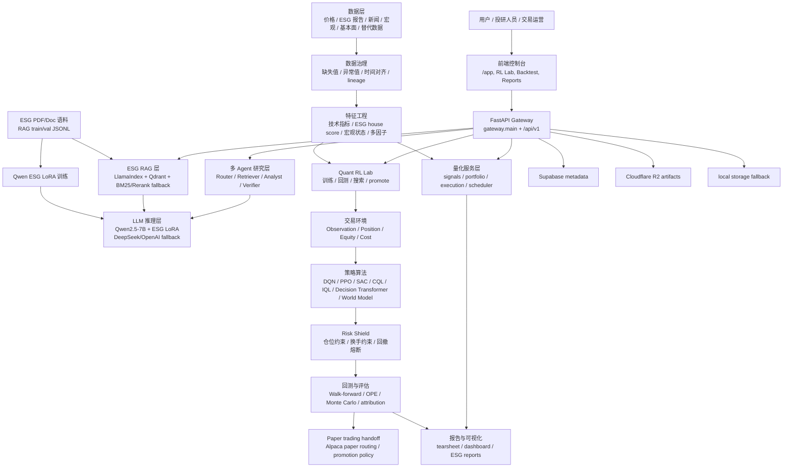

# ESG Quant Intelligence System 架构与 LinkedIn 文案

## 项目架构图

> LinkedIn 不原生渲染 Mermaid。建议把下面架构图放到 Markdown/Notion/GitHub 里渲染后截图，再作为配图发布。

## 项目用了哪些手法

- 产品架构：前端控制台 + FastAPI gateway + 模块化量化服务 + 本地/云端存储 fallback。
- ESG 智能研究：RAG 检索增强生成、多 Agent 路由与核验、结构化 E/S/G 评分。
- 量化研究：技术指标、基本面、宏观、ESG house score、多因子评分、PCA/中性化、组合优化。
- 回测与风控：交易成本模型、walk-forward、蒙特卡洛、绩效归因、回撤/仓位/换手约束。
- 模型训练：XGBoost/LightGBM/CatBoost、序列模型、事件分类器、Qwen LoRA、RL 策略训练。
- 工程化：API 合约测试、E2E、Supabase/R2、Docker/部署脚本、训练资产 bundle、promotion policy。

## RL 技能点

- 环境建模：把市场数据、ESG 分数、账户状态组合成 observation。
- Reward design：收益、交易成本、换手惩罚、回撤惩罚、仓位惩罚、ESG alignment bonus。
- Online RL baseline：Double/Dueling DQN、PPO、SAC。
- Offline RL：CQL 风格 offline DQN、IQL。
- Sequence policy：Decision Transformer，用 return-to-go 方式学习历史轨迹。
- World model：latent transition + reward/value head，并带 CEM planning。
- Bandit：LinUCB contextual bandit，用于策略路由和候选交易反馈。
- 风险护栏：Risk Shield 在策略动作进入执行前做仓位、换手、最大回撤约束。
- 评估闭环：backtest、walk-forward、OPE、promotion gate、paper trading handoff。

## Qwen 训练到什么程度

- 基座：`Qwen/Qwen2.5-7B-Instruct`。
- 方法：不是全量微调，是 ESG 领域 LoRA/QLoRA adapter。
- 数据：`data/rag_training_data/train.jsonl` 33,514 条，`val.jsonl` 3,723 条，ChatML 风格 ESG QA 数据。
- LoRA 配置：rank `r=16`，`alpha=32`，dropout `0.05`，target modules 覆盖 `q/k/v/o_proj` 和 `gate/up/down_proj`。
- 训练进度：跑满 `3 epoch / 4,191 steps`，最终 adapter 已保存到 `model-serving/checkpoint/qwen_esg_lora_v2`。
- 最优 checkpoint：`step=2600`，`eval_loss=1.4098`。后续 step 的验证 loss 上升到约 `1.57`，说明后段已有过拟合迹象，最佳版本应优先使用 `checkpoint-2600` 或 load-best 产物。
- 评估记录：`data/rag_eval/eval_report.json` 上有 3,723 个样本，平均 ROUGE-L 为 `0.3596`。这代表已经完成领域适配和可服务化，但还不是最终论文级/生产级结论模型。

## LinkedIn 文案

最近我做完了一个 ESG Quant Intelligence System 的端到端原型：把 ESG 研究、RAG、多 Agent、量化回测和强化学习策略实验放进同一个系统里。

这个项目不是单点模型 demo，而是一个完整的投研工作流：

1. ESG 报告、市场价格、宏观、基本面和替代数据进入数据治理层。
2. RAG 和多 Agent 负责检索、分析、核验，并输出结构化 ESG 证据。
3. 量化层把技术指标、ESG house score、宏观状态和账户状态转成策略 observation。
4. RL Lab 训练和比较 DQN、PPO、SAC、CQL/IQL、Decision Transformer、World Model 和 contextual bandit。
5. 最后通过 Risk Shield、walk-forward、OPE、回测报告和 paper trading handoff 做策略晋级。

我也训练了一个 Qwen2.5-7B-Instruct 的 ESG LoRA adapter：使用 33k+ ESG QA 训练样本和 3.7k 验证样本，跑完 3 个 epoch、4,191 steps。最佳 checkpoint 在 step 2600，eval loss 约 1.41。当前阶段更准确地说是“完成领域适配和可服务化验证”，不是夸张成一个最终生产模型。

这个项目里我最看重的不是单个模型分数，而是把 AI agent、RAG、量化建模、强化学习和风控护栏串成一个可以持续迭代的研究系统。

下一步会继续提升三块：

- 更严格的数据质量和真实新闻/controversy 标注。
- 更完整的 walk-forward 与 live/paper feedback loop。
- 把 RL 策略从研究候选推进到更稳健的风险约束执行层。

关键词：ESG, Quant Research, RAG, Multi-Agent Systems, Reinforcement Learning, Qwen, LoRA, Backtesting, Risk Management
